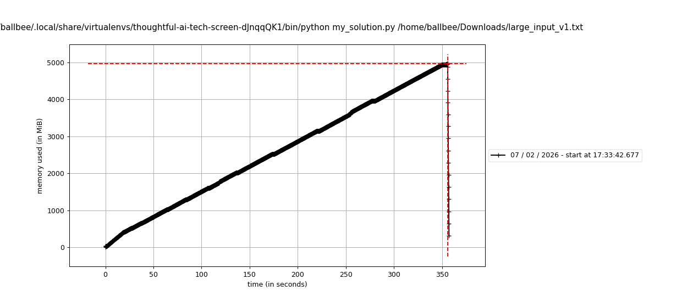
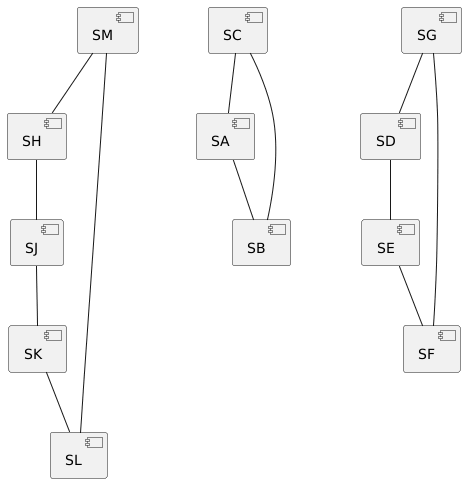

# thoughtful-ai-tech-screen

This is the solution by Brian Allbee for the [dec-8-challenge tech screen](https://gist.github.com/jose-at-thoughtful/343502a17586b2a0a3ce96f440609fa2).

> [!note]
> This was a very interesting challenge for me — given the restrictions that essentially meant writing my own graph-based processes, it was also a completely new type of problem domain for me. Regardless of how my application goes, thank you for the experience!
> That does, however, mean that I took **well** over the "less than 1 hour" cited in the [problem definition](problem-definition), though. ::shrug::

## Command-line

```
usage: my_solution.py [-h] source_file

Finds the longest routing cycle (sequence of hops) out of a data-set of
claim-ID/status-ID elements retrieved from the provided URL

positional arguments:
  source_file  The file to retrieve data from for processing

options:
  -h, --help   show this help message and exit

The Routing Cycle Detector challenge for thoughtful.ai, implemented by
Brian Allbee (brian.allbee@gmail.com) Instructions at
https://gist.github.com/jose-at-thoughtful/343502a17586b2a0a3ce96f440609fa2
```

## Overview

The task is to detect the **longest routing cycle** from a potentially very large dataset of claims, where each hop includes a `claim_id` and `status_code`. Cycles are simple (no repeated nodes), directional, and must return to the original system.

This solution:

- Streams the input file line-by-line, avoiding full file load.
- Builds per-(claim_id, status_code) graphs incrementally.
- Uses a **bounded, non-recursive DFS** with pruning to detect cycles efficiently.
- Enforces simple cycles only; no full path history is stored.
- Tracks the single longest cycle across all graphs.

## Data Structures

The solution uses `namedtuple` objects for clarity and efficiency:

- **GraphID**: Identifies a `(claim_id, status_code)` pair. This allows each graph to be stored in a dictionary keyed by GraphID.
- **SystemEdge**: Represents a directed hop from `source_system` to `destination_system`.

Benefits:

- **Hashable**: Can be used as keys in dictionaries or elements in sets, enabling quick lookups.
- **Readable**: Named fields make the code self-documenting (`edge.source_system` instead of `edge[0]`).
- **Immutable**: Prevents accidental modifications while processing millions of hops.

## Performance

- Tested on a dataset of ~11M lines.
- Runtime: ~6 minutes.
- Current memory usage could be reduced by pruning graphs that are no longer capable of producing a cycle longer than the global longest cycle.
- Memory usage peaked at ~5GB.



## Unit Testing

Core functionality is covered by `unittest`-based tests in `test_my_solution.py`:

- `TestGetHopData` – validates parsing of hops into `GraphID` and `SystemEdge`.
- `TestSearchCyclePaths` – validates non-recursive DFS cycle detection, including pruning and simple-cycle enforcement.
- `TestMainIntegration` – runs small custom graphs end-to-end; There is one custom graph-set, created from scratch, to test the process' accuracy with multiple claim/status identifiers.



# Environment

This was written against Python 3.11, but is expected to be executable under later versions. Package management was handled with `pipenv`.

> [!important]
> The `pipenv` setup and dev-only dependencies are **not required** to run the script; they are only for testing/development.

## Future Work

Potential improvements include:

- **Parallelization:** Per-(claim_id, status_code) graphs are independent, so multi-threaded or multi-process execution could reduce runtime.
- **Graph pruning:** Discard graphs that cannot produce cycles longer than the global longest cycle to reduce memory usage.
- **Profiling & optimization:** Further memory and CPU profiling could help optimize performance for very large datasets.

## Usage

```bash
python3 my_solution.py <data_file>
```

Example output:

```
123,197,3
```
